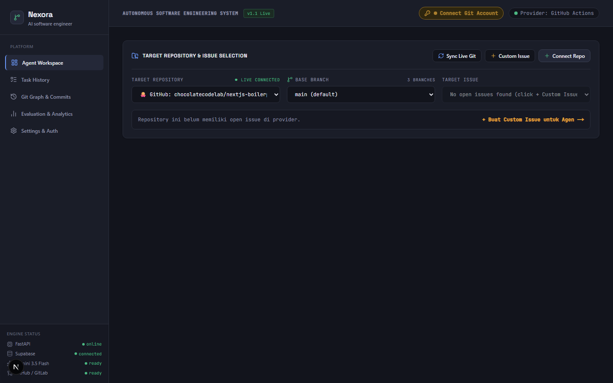
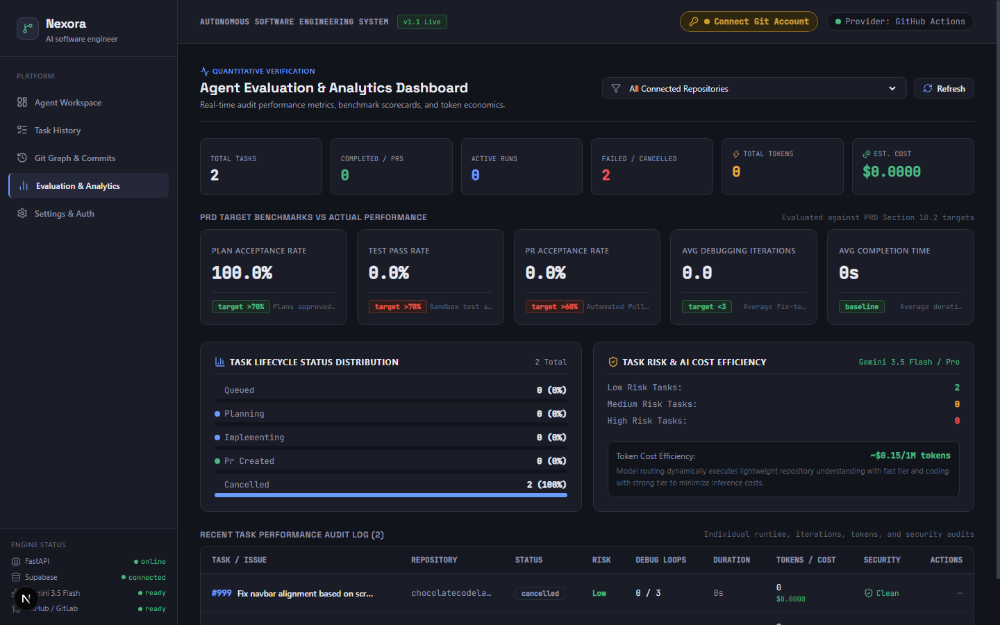
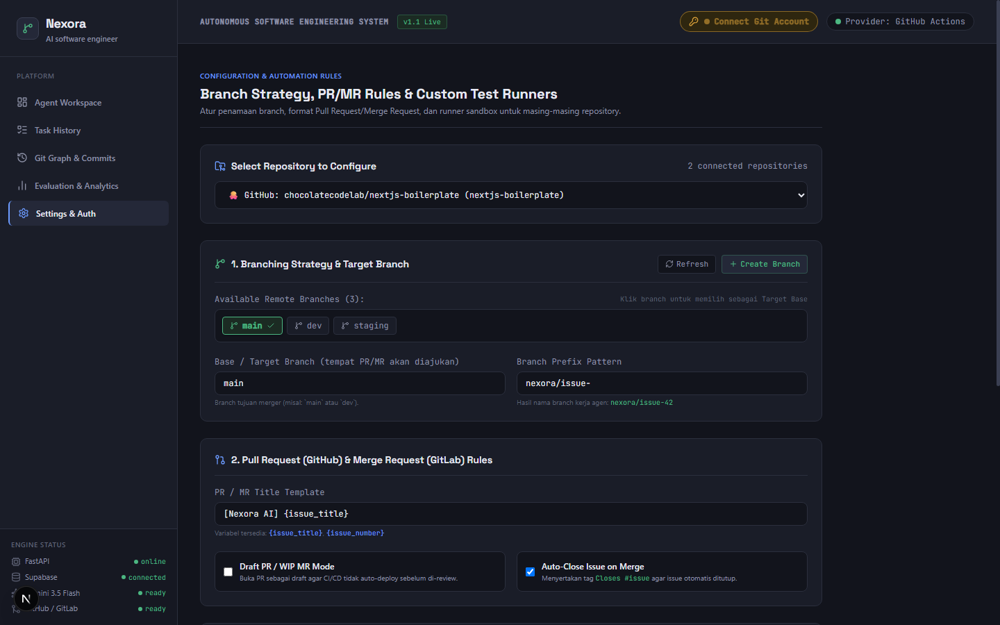
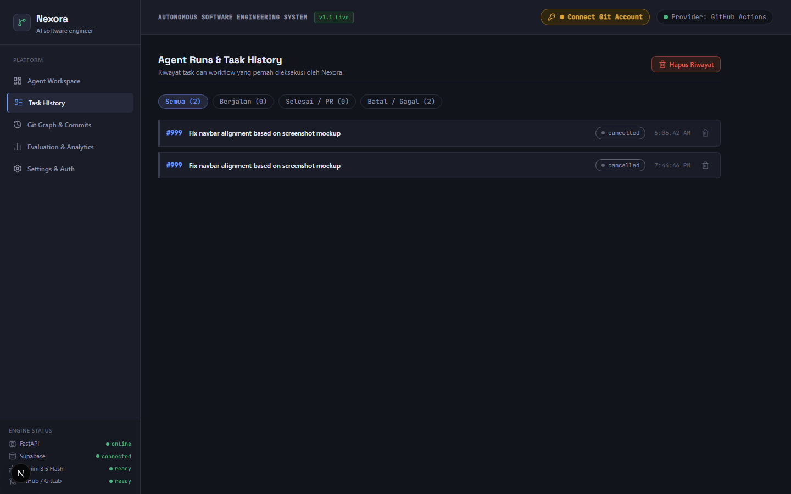
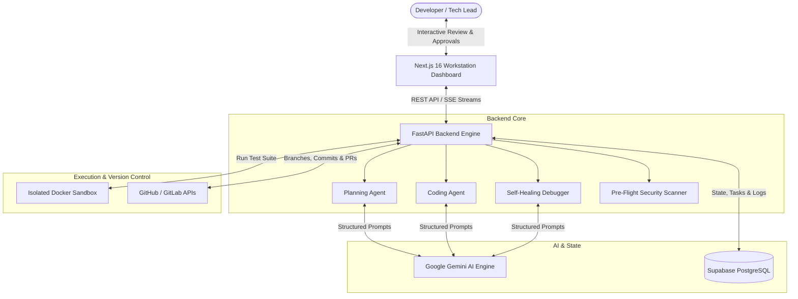

<div align="center">

# ⚡ Nexora AI
### Autonomous Software Engineer Workstation

[](LICENSE)
[](https://python.org)
[](https://fastapi.tiangolo.com)
[](https://nextjs.org)
[](https://tailwindcss.com)
[](https://ai.google.dev/)
[](https://www.docker.com/)

**From Issue to Pull Request — an autonomous AI Software Engineer that plans, codes, tests, and ships with human-in-the-loop oversight.**

[Key Features](#-key-features) • [Interface Preview](#-workstation-interface-preview) • [Architecture](#-architecture) • [Quick Start](#-quick-start) • [Docker Setup](#-docker-setup) • [CI/CD](#-cicd-pipeline) • [Contributing](#-contributing)

</div>

---

## 📌 Executive Summary

**Nexora** is an open-source, agentic software engineering platform. It transforms GitHub and GitLab issues into clean, tested, and verifiable Pull Requests.

Unlike opaque "magic coding bots", Nexora functions as an **auditable co-engineer**. Every plan step, tool execution, test failure log, and git diff is streamed in real time to a developer-grade workstation UI, ensuring humans retain full decision-making control before code hits production.

---

## ✨ Key Features

- **🤖 5-Stage Autonomous Agent Pipeline**:
  1. **Planner**: Analyzes repository context, reproduces the problem, and drafts an atomic step-by-step implementation plan.
  2. **Coder**: Generates targeted file modifications and test cases using Google Gemini.
  3. **Sandbox Runner**: Executes tests in an isolated, non-destructive container environment.
  4. **Self-Healing Debugger**: Automatically analyzes stack traces and iterates fixes up to configurable debug limits.
  5. **PR Publisher**: Formats standardized Pull Requests with issue linking, changesets, and test logs.
- **🛡️ Pre-Flight Security Guardrails**: Built-in AST syntax validation and regex-based secret scanning prevent accidental leaks or broken syntax from being committed.
- **👁️ Human-in-the-Loop Auditability**: Interactive Plan Review modal with manual approval/rejection, plus real-time task commenting.
- **🔀 Multi-Provider Git Engine**: Native integration for both **GitHub** (App / Personal Access Token) and **GitLab** (Merge Requests & Pipelines).
- **📊 Real-time Workstation UI**: Next.js 16 terminal-inspired dashboard with live log streaming, side-by-side code diff viewer, and benchmark evaluation metrics.
- **🚀 Cloud-Ready Deployment**: Includes tested configurations for **Google Cloud Run** (Free Tier Scale-to-Zero), **Hugging Face Spaces**, and **Render.com**.

---

## 🖥️ Workstation Interface Preview

<div align="center">
  
  <p><sub><em>Figure 1: Autonomous Software Engineering Cockpit — multi-repo picker, branch manager, and real-time engine health telemetry.</em></sub></p>
</div>

<br/>

<div align="center">
  
  <p><sub><em>Figure 2: Quantitative Evaluation & Benchmark Scorecard — audit performance metrics, PR acceptance targets, and token economics.</em></sub></p>
</div>

<br/>

<details>
<summary><b>🔍 Click to view more interface previews (Branch Automation Rules & Task History)</b></summary>
<br/>

### 1. Branch Strategy & Automation Rules
<div align="center">
  
  <p><sub><em>Figure 3: Git workflow configuration, PR/MR title templates, WIP draft gates, and branch prefix rules.</em></sub></p>
</div>

### 2. Agent Runs & Task History
<div align="center">
  
  <p><sub><em>Figure 4: Comprehensive execution history, status filters (Active, Completed, Failed), and run cleanup controls.</em></sub></p>
</div>

</details>

---

## 🏛️ Architecture



---

## 🛠️ Tech Stack

| Domain | Technology | Description |
|---|---|---|
| **Backend API** | Python 3.10+, FastAPI, Pydantic v2 | High-performance asynchronous REST API |
| **LLM Provider** | Google Gemini API (`google-genai`) | Code understanding, plan formulation, and patch generation |
| **Database & Auth** | Supabase (PostgreSQL) | Task state persistence, tool call logs, and branch configurations |
| **Frontend UI** | Next.js 16, React 19, Tailwind CSS v4 | High-density developer workstation with Lucide React icons |
| **Code Execution** | Docker / Alpine Linux Sandbox | Safe and reproducible automated test execution |
| **Git Integrations** | GitHub REST API, GitLab REST API | Branch creation, commit pushes, and Pull/Merge Requests |
| **CI/CD** | GitHub Actions & GitLab CI | Automated unit testing, container build, and Cloud Run deployment |

---

## 🚀 Quick Start

### Prerequisites
- Python 3.10+
- Node.js 20+ and npm
- Git
- A [Google Gemini API Key](https://aistudio.google.com/)
- A [Supabase Project](https://supabase.com/)

### 1. Clone the Repository
```bash
git clone https://github.com/<your-username>/nexora-app.git
cd nexora-app
```

### 2. Configure Environment Variables
```bash
# Backend environment setup
cp backend/.env.example backend/.env
```

Edit `backend/.env` with your API keys:
```env
GEMINI_API_KEY=your_gemini_api_key
SUPABASE_URL=https://your-project.supabase.co
SUPABASE_SERVICE_ROLE_KEY=your_supabase_service_role_key
APP_ENV=development
```

*(Optional: Run `backend/schema.sql` in your Supabase SQL Editor if you want to initialize the database tables manually.)*

### 3. Start Backend
```bash
cd backend
python -m venv .venv

# Windows (PowerShell)
.venv\Scripts\Activate.ps1
# Linux / macOS
source .venv/bin/activate

pip install -r requirements.txt
uvicorn main:app --reload --port 8000
```
Backend API will be running at `http://127.0.0.1:8000` (Interactive docs at `/docs`).

### 4. Start Frontend
In a new terminal:
```bash
cd frontend
npm install
npm run dev
```
Open `http://localhost:3000` to launch the Nexora Workstation.

---

## 🐳 Docker Setup

Run the complete multi-service stack with a single command:

```bash
# 1. Create Docker environment file
cp .env.docker.example .env.docker

# 2. Fill in your GEMINI_API_KEY and SUPABASE credentials in .env.docker

# 3. Build and launch containers
docker compose up --build
```

- **Frontend Workstation**: `http://127.0.0.1:3001`
- **Backend API**: `http://127.0.0.1:8001` (Docs: `http://127.0.0.1:8001/docs`)

---

## 🧪 Testing

Nexora includes an extensive automated test suite covering security guardrails, branch management, multimodal attachments, and remote git integration:

```bash
cd backend
pytest -v
```

---

## 🌐 Deployment Options

### 1. Google Cloud Run (Free Tier Compatible)
Both `.github/workflows/ci-cd.yml` and `.gitlab-ci.yml` are pre-configured to build container images and deploy them to Cloud Run with scale-to-zero settings (`--min-instances 0 --max-instances 2 --memory 512Mi`).

### 2. Hugging Face Spaces (Docker SDK)
The backend includes a Hugging Face Space metadata header in `backend/README.md`. Simply point your Space repository to the `backend/` directory with `sdk: docker` and port `7860`.

### 3. Render.com
A ready-to-use [`render.yaml`](render.yaml) Blueprint is included in the project root for 1-click web service deployment.

---

## 📁 Repository Structure

```
nexora-app/
├── .github/
│   └── workflows/
│       └── ci-cd.yml         # GitHub Actions: Pytest, Next.js build, Cloud Run deploy
├── .gitlab-ci.yml            # GitLab CI pipeline configuration
├── docker-compose.yml        # Multi-container orchestration (Frontend, Backend, Sandbox)
├── render.yaml               # Render Infrastructure-as-Code blueprint
├── LICENSE                   # Open Source MIT License
├── CONTRIBUTING.md           # Guidelines for developers and contributors
├── PRD-Nexora-AI-Agentic...  # Complete Product Requirements Document
├── design-Nexora.md          # Visual & UX Engineering Specification
│
├── backend/                  # FastAPI Application
│   ├── app/
│   │   ├── models/schemas.py # Pydantic data contracts
│   │   ├── routers/          # API endpoints (tasks, projects, auth, evaluation)
│   │   └── services/         # Core AI, Git, Sandbox, and Security engines
│   ├── tests/                # Pytest test suite (8 test modules)
│   ├── schema.sql            # Idempotent Supabase SQL migrations
│   ├── Dockerfile            # Production backend container
│   └── requirements.txt      # Python dependencies
│
├── frontend/                 # Next.js 16 Workstation Dashboard
│   ├── app/                  # App Router pages and global CSS
│   ├── components/           # UI components (Diff Viewer, Stepper, Logs, Modals)
│   ├── lib/api.ts            # Dynamic local/docker API client
│   └── Dockerfile            # Production frontend container
│
└── sandbox/                  # Isolated environment for test execution
    └── Dockerfile            # Lightweight testing container
```

---

## 🤝 Contributing

Contributions are welcome! Please read our [Contributing Guide](CONTRIBUTING.md) for local setup, branching strategies, and pull request conventions.

---

## 📄 License

This project is licensed under the [MIT License](LICENSE).
